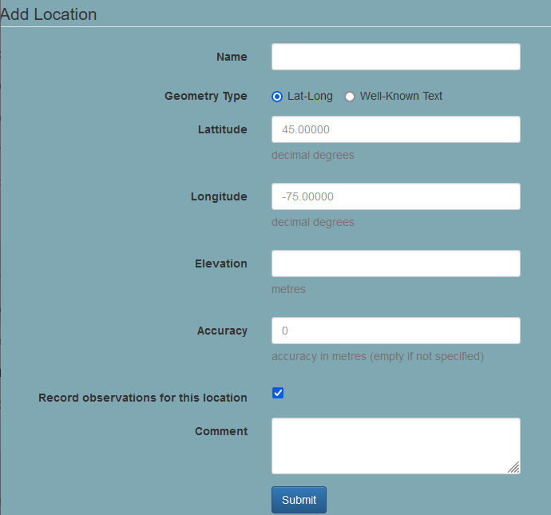
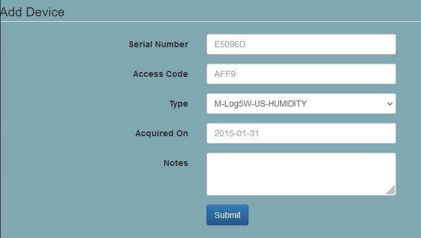
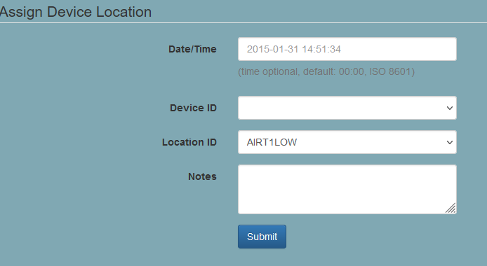
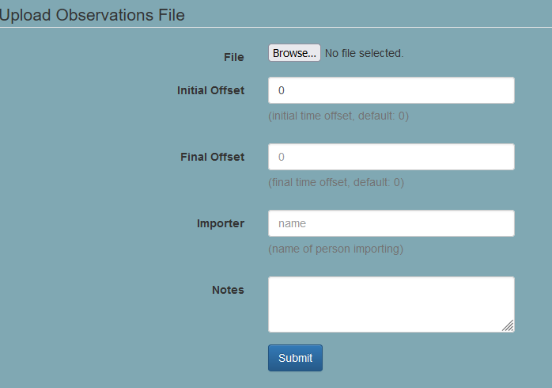
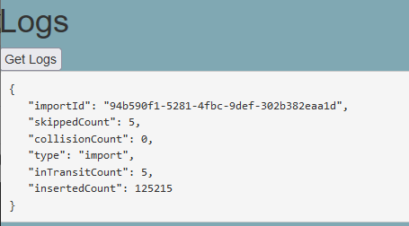

# sensorDb
[](https://github.com/geocryology/sensorDb/actions/workflows/maven.yml)

sensorDB is a webservice that facilitates writing data to a permafrost database.

### Table of Contents
1. [Installation](#_installation)
2. [Dockerized installation](#_docker)
3. [Usage](#_usage)
   1.  Adding a Location
   2.  Adding a device
   3.  Assigning device location
   4.  Uploading observations files
   5.  Logs
6. [Schema](#schema)


## Installation
<a name="_installation"/>

### Install dependencies
sensorDb requires Maven, Java 8, and Nunaliit 2.2.9. 

```bash
apt-get install maven
apt-get install openjdk-8-jdk
```
If you have multiple versions of Java installed, make sure that you switch to Java 8: `update-java-alternatives --set <Directory where JAVA 8 has been extracted>/bin/java`

```bash
MAINDIR=/opt
cd $MAINDIR
git clone https://github.com/GCRC/nunaliit
cd nunaliit
git checkout nunaliit2-2.2.7
mvn clean compile
mvn clean install
```

The original version of sensorDb uses 2.2.9-SNAPSHOT as a dependency, but there the [resources are missing](https://mvnrepository.com/artifact/ca.carleton.gcrc/nunaliit2-json) for the 2.2.9 version, so the dependency has been reverted to 2.2.7.

If you want to use the Nunaliit 2.2.9 binary, you can get it from https://github.com/GCRC/nunaliit/releases. Then install it according to the  [Nunaliit installation instructions ](https://github.com/GCRC/nunaliit/wiki/Installation).


### Install SensorDb

```bash
MAINDIR=/opt/
SDB_VER=0.0.1-SNAPSHOT

# Download and build sensordb
cd $MAINDIR
git clone https://github.com/geocryology/sensorDb
cd sensorDb
mvn clean compile
mvn clean install

# add sensorDb to path
cd $MAINDIR"sensorDb/sensorDb-command/target/"
tar zxvf "sensorDb-command-"$SDB_VER"-sensorDb.tar.gz"
chmod -R o+r,o+x "sensorDb-command-"$SDB_VER"-sensorDb.tar.gz"
export PATH=$PATH:/usr/local/nunaliit_VERSION_DATE_BUILD/bin
export PATH=$PATH:$MAINDIR"sensorDb/sensorDb-command/target/sensorDb-command-"$SDB_VER"/bin"
```

### Configuration
To configure a new sensorDb server, run `sensorDb create` (ensure the sensorDb-command bin directory is on your `PATH`). You will be prompted for the following information:

* port: *any port is ok.*
* connection string: *in the format `//HOST:PORT/DATABASE` (e.g. `//206.12.92.139:5432/observations`).*
* user: sensordb *your database must have a user role by this name with write-access and an entry in pg_hba.conf* 
* password: *database password for chosen `user`*

To launch sensorDb, type `sensorDb run`.  If you log out of your terminal session, sensorDb will stop running. If you log back in, you will need to add the sensorDb path to $PATH again.

### Run sensorDb as a background service
To have sensorDb run automatically when the system starts, create the file `sensordb.service` in the directory `/etc/systemd/system`: 

```bash
[Unit]
Description=Permafrost database interface.
After=network.target
StartLimitIntervalSec=0

[Service]
Type=simple
WorkingDirectory=/home/nbr512/sensorDb_Server
ExecStart=/opt/sensorDb/sensorDb-command/target/sensorDb-command-0.0.1-SNAPSHOT/bin/sensorDb run
Restart=always
RestartSec=1

[Install]
WantedBy=multi-user.target
```

Make sure your ExecStart points to the correct sensordb /bin directory and that the working directory has a sensordb configuration. To activate the service, type: `sudo systemctl enable sensordb`

### Setting up proxy server
If you want sensorDb to be reachable from a web address, you will want to set up a reverse proxy.  Follow the instructions at
  https://github.com/GCRC/nunaliit/wiki/Proxying-Nunaliit-with-Apache2-and-SSL

### Troubleshooting
* Make sure the user sensordb has an entry in pg_hba.conf
* If you aren't able to install the Nunaliit 2.2.9 binary, you can try installing Nunaliit 2.2.7 from source, and changing the dependency in `pom.xml`


## Running with Docker
<a name="_docker"/>

SensorDB can be run as a docker container.  For more containerization, both the and SensorDB can be run as a docker-compose service using the prototype [SensorDB-suite repository](https://github.com/geocryology/permafrostdb-suite).

### Create a new configuration
Use the following command, copied exactly, to create a new sensorDb configuration:

```bash
docker run -it -v myconfig:/opt/sensorDb/config geocryology/sensordb create
```

Follow the on-screen prompts. The first question asks where to create the configuration; this will become the name of a new subdirectory within the `myconfig` storage volume.  The name `config` cannot be used as it is used by the default configuration. The name provided here will be used when running sensorDb in the next step.

```
Enter location where server should be created: jam
Enter the port for the server: 5005
Enter the database connection string: 123.45.678.90:5432/observations
Enter the database user: sensordb
Enter the database password: password
```

### Running an existing configuration
To run sensorDb using a previously defined configuration, use the following command, but replace 'jam' in `-w /config/jam` with the location you specified in the last step.  

```bash
docker run -it -v myconfig:/opt/sensorDb/config -w /config/jam  geocryology/sensordb
```

To get a list of previously defined configurations
```
docker run -it -v myconfig:/opt/sensorDb/config --entrypoint ls geocryology/sensordb  /config
```


## Usage
<a name="_usage"/>

SensorDB is a one-page web application that allows users to add locations, devices, and observations to the database.

### Adding a Location
To add a new location to the database, fill out the "Add location" subsection and click "Add Location". The location will be added to the database and will appear in the `locations` table.



The 'record observations for this location' indicates whether sensor observations from the location should be retained (i.e. field sites) or discarded (i.e. 'in storage' location).

### Adding a device
To add a new device to the database, fill out the "Add device" subsection and click "Submit". The device will be added to the database and will appear in the `devices` table. Note that this form only works for devices with a pre-existing template (picked from the `type` dropdown) in the database. If you need to add a new device type, you will need to add a new record to the `device_sensor_profiles` table in the database.



### Assigning device location
To assign an existing device to an existing location, fill out the "Assign Device Location" subsection and click "Submit". The device will be assigned to the location and will appear in the `devices_locations` table.




### Uploading observations files
To upload a file of observations, select a file in the "Upload Observation File" subsection and fill out the required information. SensorDb currently only accepts Geoprecision (GP5W) file formats.



Information on how records are updated:
* If a time offset is provided (i.e. a measured drift in the sensor clock), sensorDb will 'correct' the time records by averaging out the observed drift over the entire time series.
* Observations are only uploaded to the database if the corresponding sensor location is configured to record observations (i.e. `record_observations` is `True` for the location record.) 
* The import system creates a MD5 hash of each observation, using the column name, device serial number and the row of text. If this hash is found to match an existing observation in the database (using the `import_id`), the observation is skipped to avoid duplication. The number of skipped observations will be noted in the report. This means that re-uploading the same file will not cause duplicate imports, but if the file is changed, a duplicate may be possible.
* Uploading a file takes some time, the log may not be generated immediately.

#### Logs
After an observation file is uploaded, a log is generated. The log contains information on the number of observations uploaded, the number of observations skipped, and the number of observations that failed to upload. The log can be accessed by clicking on the 'Get Logs' button at the bottom of the page.



- `importId` is the unique identifier for the upload transaction. It is generated by the system and stored in the database.  It can be used to 'roll-back' uploads.
- `skippedCount` is the total number of observations that were skipped. Observations may be skipped for a variety of reasons.
- `collisionCount` is the number of observations that were skipped because they were found to be duplicates of observations already in the database.
- `type` is the transaction type. Presently, it can only be 'import'.
- `inTransitCount` is the number of observations that are skipped because the device is reported as being 'in Transit' (e.g. on the way to the field site).
- `insertedCount` is the number of observations that were successfully inserted into the database.
 
# Schema


